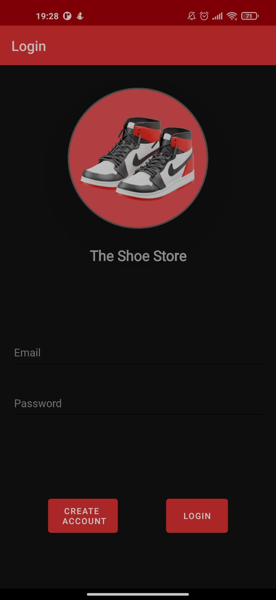
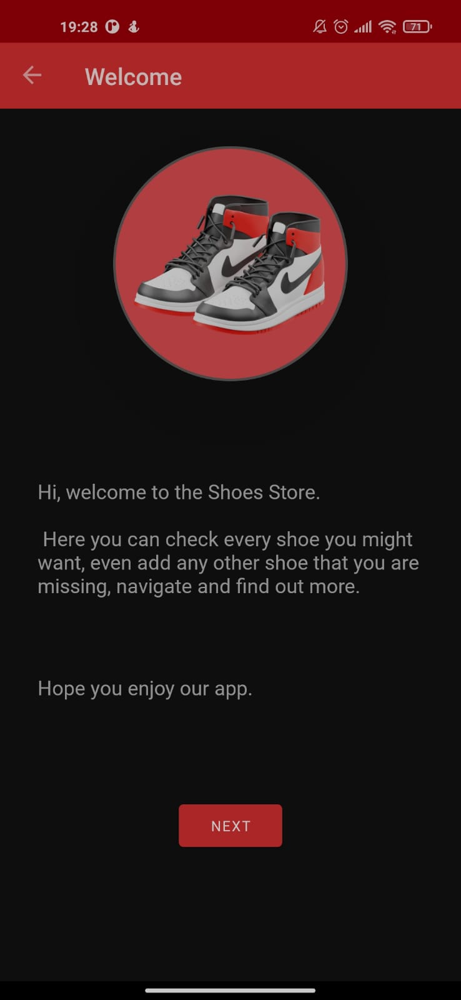
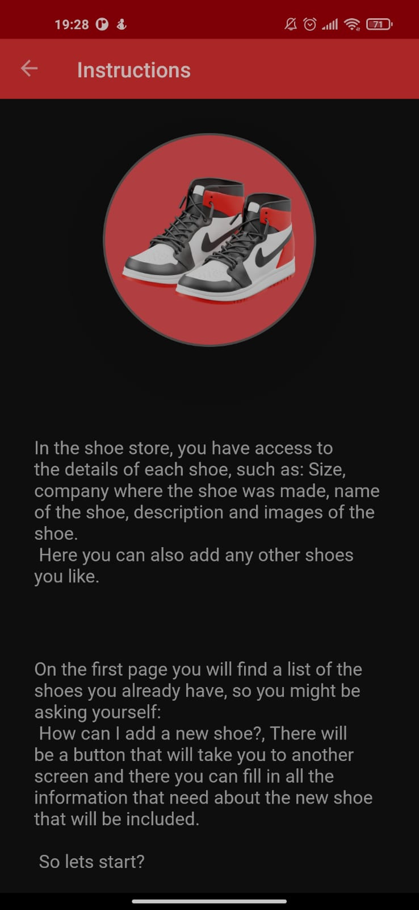
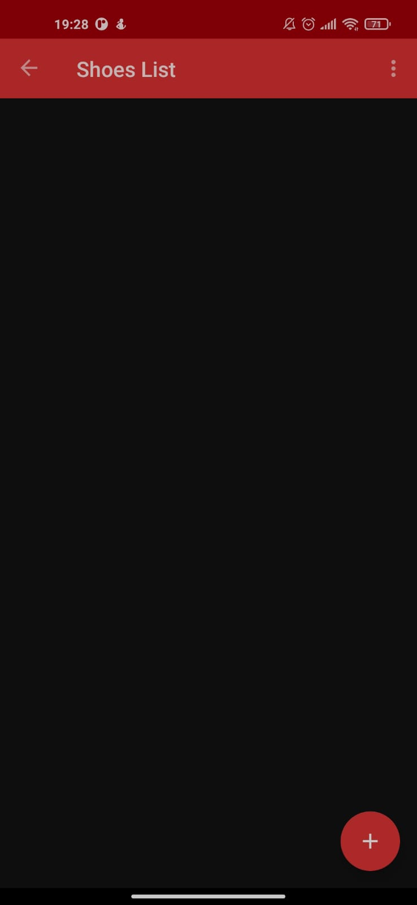
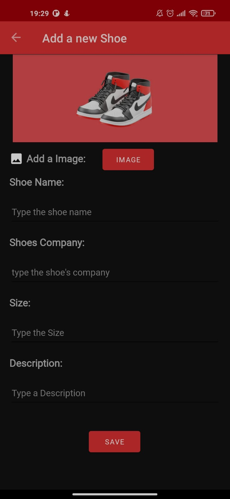
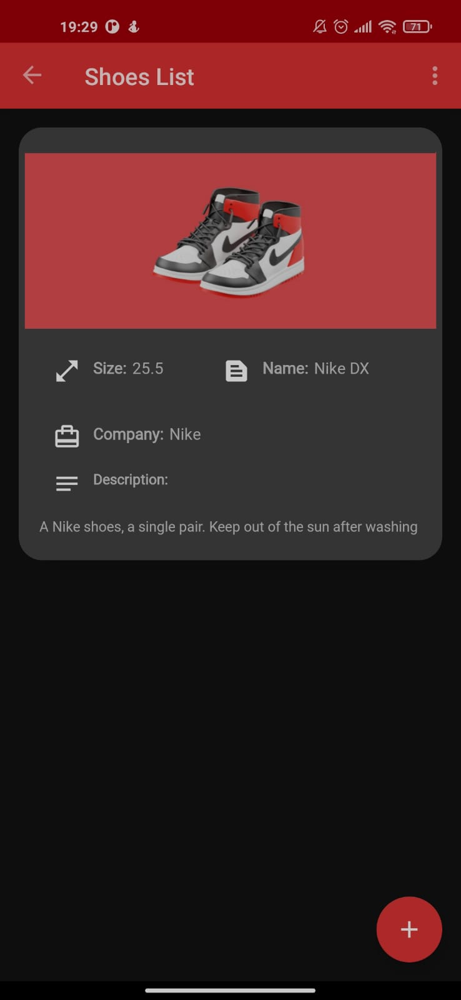

# The Shoe Store

Shoe Store App for Android Kotlin Developer NanoDegree by Udacity.

## Developemnt Steps

This project will consist of five screens. You don't have to create a shoe store, you can use any other item as long as you create the following screens. You will be creating:

 - Login screen: Email and password fields and labels plus create and login buttons
 - Welcome onboarding screen
 - Instructions onboarding screen
 - Shoe Listing screen
 - Shoe Detail screen for adding a new shoe

## Projects Screens

 
 
 

